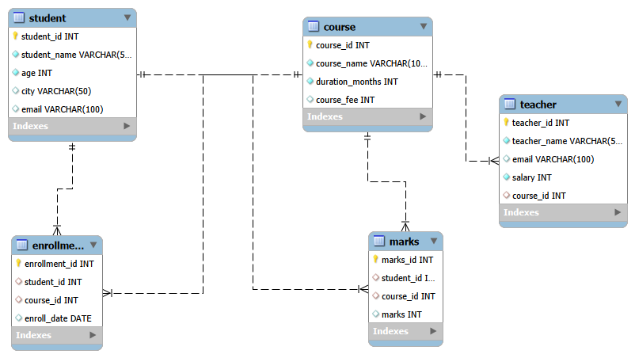

# College Management System

## Project Overview

The College Management System is a MySQL database project designed to manage student, course, teacher, enrollment, and marks data.

The project demonstrates relational database concepts and SQL operations including table creation, primary keys, foreign keys, joins, aggregate functions, subqueries, grouping, filtering, updating, and deleting records.

## Database Structure

The project contains five tables:

- Student
- Course
- Teacher
- Enrollment
- Marks

## Table Relationships
- The Teacher table is connected to the Course table using course_id.
- The Enrollment table connects students with their respective courses.
- The Marks table stores the marks obtained by students in their courses.
- Primary keys uniquely identify records in each table.
- Foreign keys maintain relationships between tables.

 ## ER Diagram

## SQL Concepts Used

- CREATE DATABASE
- CREATE TABLE
- PRIMARY KEY
- FOREIGN KEY
- NOT NULL
- UNIQUE
- INSERT
- SELECT
- WHERE
- INNER JOIN
- Aggregate Functions
- GROUP BY
- HAVING
- ORDER BY
- LIMIT
- Subqueries
- UPDATE
- DELETE

## Project Features

- Store and manage student information.
- Store course and teacher details.
- Enroll students in different courses.
- Store student marks.
- Display student, course, and marks information using multiple table joins.
- Calculate average, maximum, and minimum marks.
- Find students scoring above average marks.
- Perform date-based enrollment queries.
- Update and delete database records.

## Technologies Used

- MySQL
- MySQL Workbench

## Author

Parmeet
